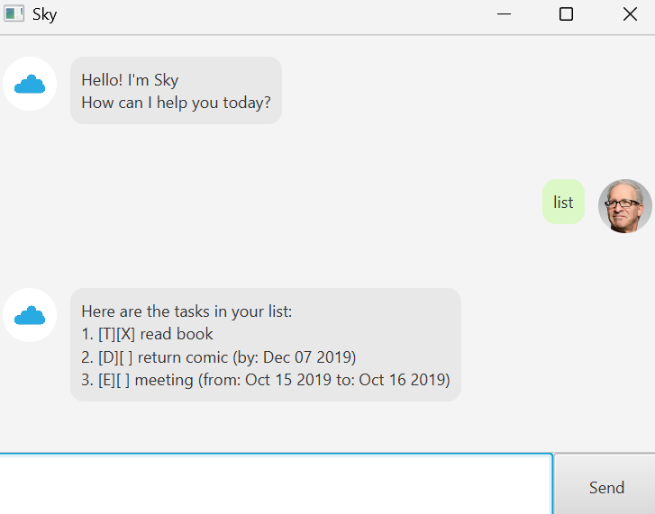

# Sky User Guide



Sky is a simple and intuitive task manager with a conversational interface.
It helps you manage todos, deadlines, and events efficiently.

---

## 🚀 Getting Started

When you launch Sky, you will see a welcome message.
Type a command into the input box and press Enter or click **Send**.

---

## 📋 Listing Tasks
```
list
```
Displays all tasks currently stored.

---

## ✅ Adding a Todo
```
todo <description>
```
Example
```
todo read book
```

---

## 📅 Adding a Deadline
```
deadline <description> /by <yyyy-mm-dd>
```
Example
```
deadline return comic /by 2019-12-07
```

---

## 🗓 Adding an Event
```
event <description> /from <yyyy-mm-dd> /to <yyyy-mm-dd>
```
Example
```
event meeting /from 2019-10-15 /to 2019-10-16
```

---

## 🔄 Updating a Task

Sky allows you to update tasks without deleting them.

### Update Description
```
update <task number> /desc <new description>
```
Example
```
update 1 /desc read comic
```

### Update Deadline Date
```
update <task number> /by <yyyy-mm-dd>
```
Example
```
update 2 /by 2019-12-10
```

### Update Event Dates
```
update <task number> /from <yyyy-mm-dd> 
update <task number> /to <yyyy-mm-dd>
```
Example
```
update 3 /from 2019-10-16 
update 3 /to 2019-10-17
```

---

## ✔ Mark Task as Done
```
mark <task number>
```
Example
```
mark 5
```

---

## ❌ Unmark Task
```
unmark <task number>
```
Example
```
unmark 8
```

---

## 🗑 Delete Task
```
delete <task number>
```
Example
```
delete 8
```

---

## 🔍 Find Tasks
```
find <keyword>
```
Example
```
find book
```

---

## 👋 Exit
```
bye
```